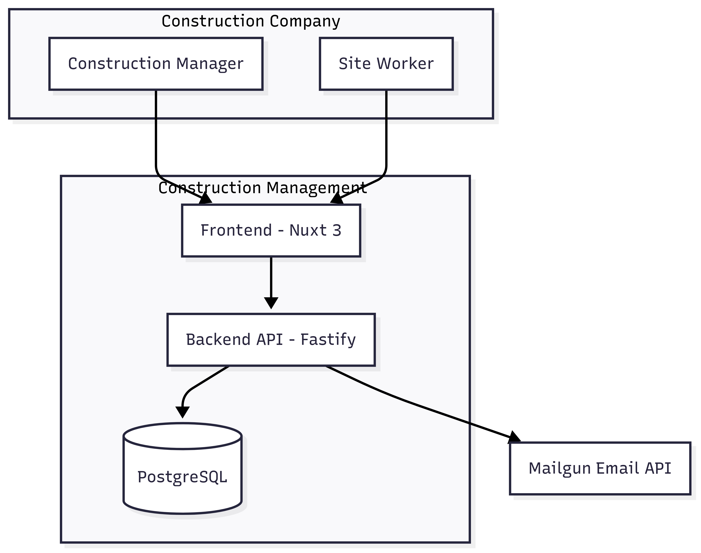
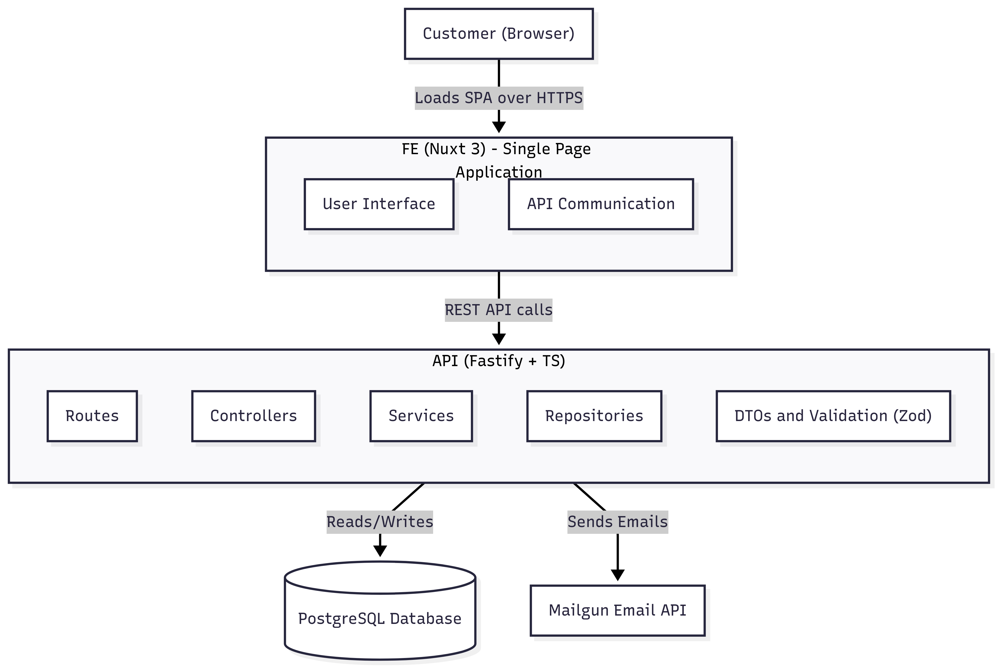

# 3. System Scope and Context

## 3.1 Business Context

This software is a **Construction Management Platform** designed for small to mid-sized construction companies.
Its primary use cases include:

- Managing construction **companies**, their **users**, and **job sites**
- Assigning workers to sites
- Tracking **materials** needed or delivered on sites
- Sending transactional emails (invitations, password resets, notifications)

It is used and commissioned by **Fliesen Hönle**, a tile and flooring company in Germany.

### Primary Users

| Role                  | Description                                                   |
|-----------------------|---------------------------------------------------------------|
| **Construction Manager** | Creates and manages users and job sites, assigns workers     |
| **Site Worker**          | Views assigned sites, checks in, sees material deliveries    |
| **Admin (Developer)**    | Manages infrastructure, monitors deployments and errors      |

## 3.2 System Boundary

The system is a **multi-tenant web application** consisting of:

- A **frontend** (Nuxt 3) for all user interaction
- A **backend API** (Fastify) handling authentication, validation, and data access
- A **PostgreSQL** database with Prisma as ORM
- Integration with **Mailgun** for sending transactional emails

All services are self-hosted in the EU and follow GDPR compliance.

## 3.3 External Interfaces

| Actor                | Interface                                           |
|----------------------|----------------------------------------------------|
| **Construction Manager** | Accesses the web UI via browser                   |
| **Site Worker**          | Accesses the mobile-optimized UI                   |
| **Mailgun**              | Sends signup, recovery, and system notification emails |
| **Admin / Developer**    | Receives logs, manages deploys, CI/CD pipelines    |

## 3.4 C4 Level 1 – Context Diagram

## 3.5 Technical Context

The system follows a **layered architecture** inside a Node.js-based monorepo:

| Layer         | Responsibility                                                                  |
|---------------|---------------------------------------------------------------------------------|
| `web/`        | Frontend in Nuxt 3. Handles routing, layout, user sessions, and API calls.      |
| `api/`        | Fastify-based server using TypeScript. Exposes secured REST endpoints.          |
| `shared/`     | Shared DTO types and `zod` validation schemas used in both web and API layers.  |
| `PostgreSQL`  | Data storage via Prisma, enforcing company-based multi-tenancy.                  |
| `Mailgun`     | Used for sending all system-triggered emails (invite, reset, notifications).    |

## 3.6 C4 Level 2 – Container Diagram

