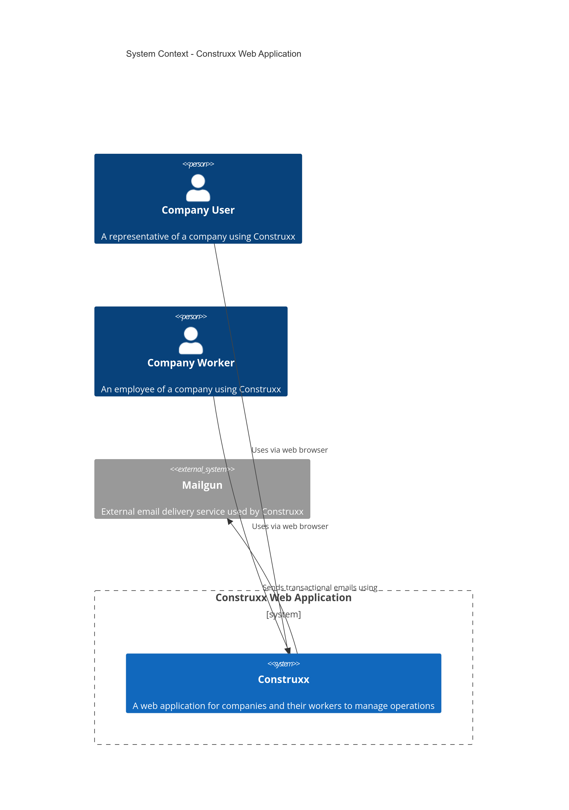
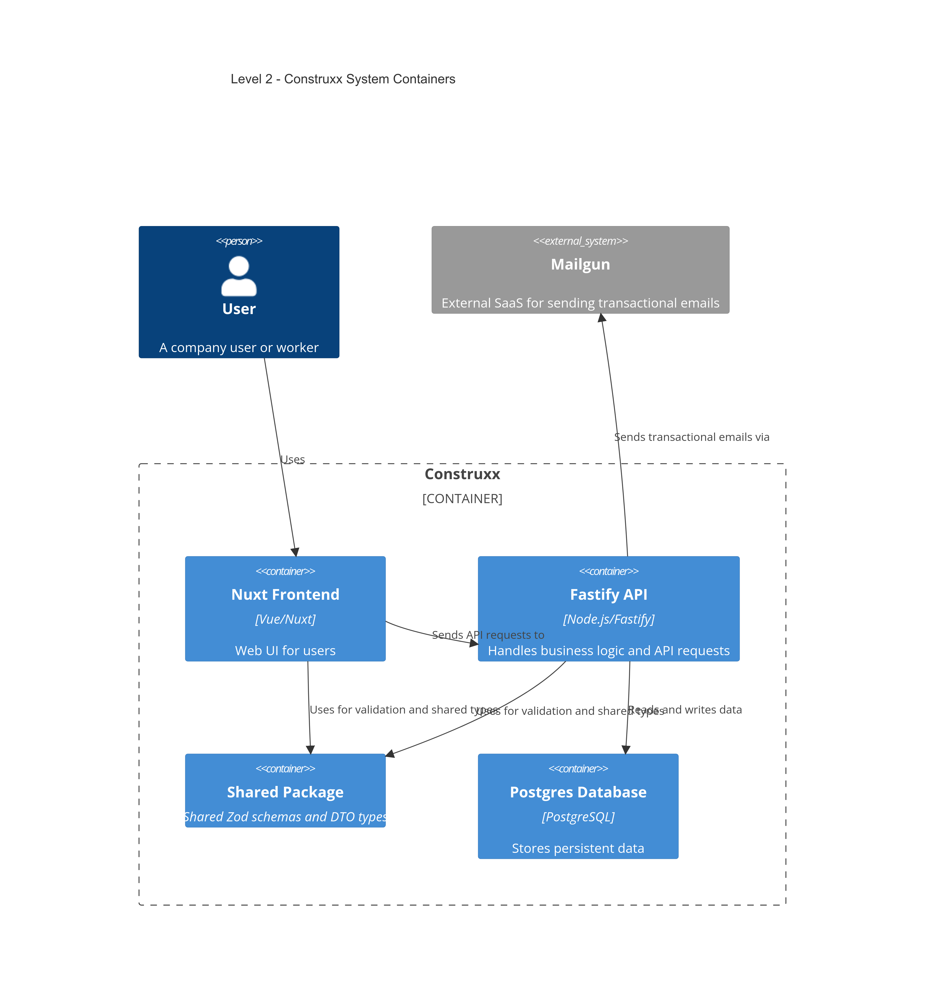
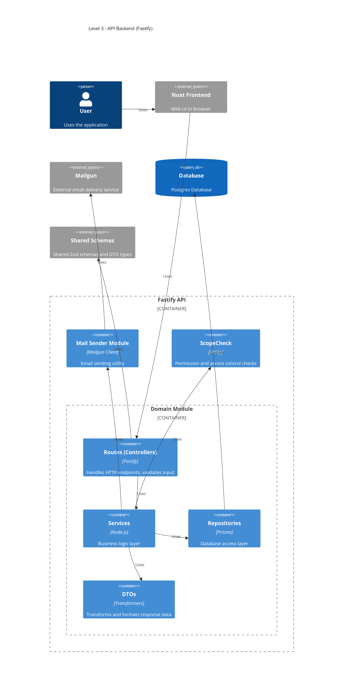
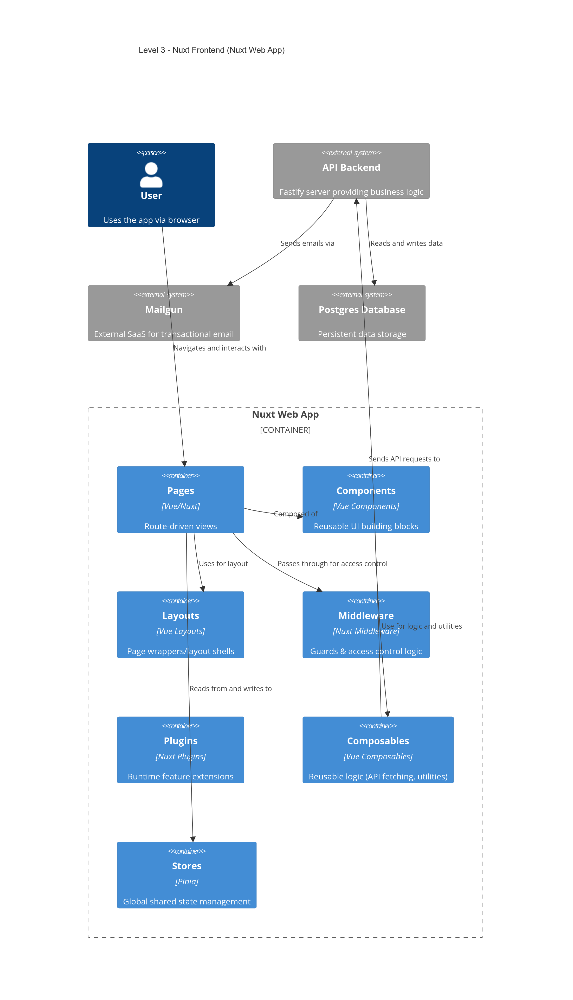
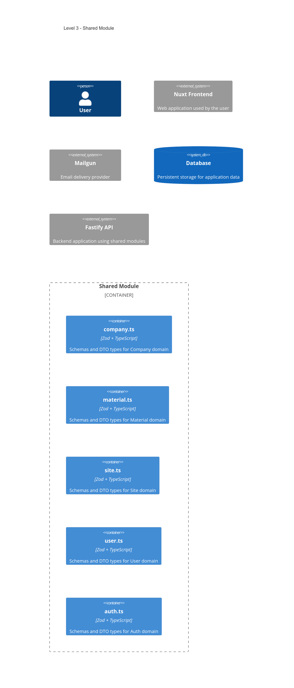
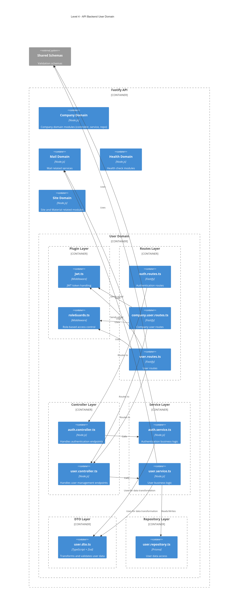

# Building Block View

## Level 1 — Whitebox Overall System

**Motivation**
This system is a modular, full-stack web application supporting multi-tenant company management, role-based access control, site and material tracking, and email-based authentication.

**Contained Building Blocks**
- **Web Frontend (Nuxt)**
- **API Backend (Fastify)** — includes controllers, services, repositories, routes, and DTOs for domain mapping
- **PostgreSQL Database**
- **Shared Zod Schemas and TypeScript Types**
- **Mailgun Integration**

**Important Interfaces**
- REST API between frontend and backend
- Prisma ORM between backend and database
- Mailgun HTTP API
- Shared validation schemas (Zod) used across frontend and backend

---

## Level 2 — Internal Composition of Main Building Blocks

### Web Frontend (Nuxt)

- File-based routing with pages for auth, company, user, site, and profile
- Modular components grouped by domain (Auth, Company, Users, Site)
- Uses shared Zod types for form validation and props
- Components are reused across views, promoting consistency

### API Backend (Fastify)

- Layered architecture: Routes → Controllers → Services → DTOs → Repositories
- Domain modules: Auth, User, Company, Site, Material
- Plugins: JWT authentication, role-based guards, health checks
- Mail module for sending transactional emails (e.g. verification, password reset)
- Prisma ORM used for data access

### Shared Zod Schema Module

- Zod schemas and TypeScript types shared across backend and frontend
- Domain-specific schema files:
  - `auth.ts`, `user.ts`, `company.ts`, `site.ts`, `material.ts`
- Promotes consistency in validation and data structure

---

## Level 3 — Deep Dive: Domain Structures

### User Domain — API Backend

- **Routes**
  - `auth.routes.ts`, `user.routes.ts`, `company.user.routes.ts`
- **Controllers**
  - `auth.controller.ts`, `user.controller.ts`
- **Services**
  - Business logic for auth and user management
- **Repositories**
  - Data access via Prisma (`user.repository.ts`)
- **DTOs**
  - Data transformation and Zod-based validation
- **Security**
  - Middleware: JWT auth, role guards
- **Integration**
  - Mail service for notifications and authentication flows

### Component Structure — Web Frontend (Nuxt)

- Modular component grouping:
  - **Auth:** LoginForm, RegisterUserForm, RegisterCompanyForm
  - **Company:** OverviewCard, CompanyDetailsCard
  - **User:** DashboardActions, UserCard, Modals
  - **Site:** Info sections, SiteCard, Material tracking
- Pages composed from modular domain components
- Uses shared Zod schemas for strong typing and validation
- Communicates with Fastify API for data persistence and logic

### Shared Module

- Domain-specific schema files:
  - `auth.ts`, `user.ts`, `company.ts`, `site.ts`, `material.ts`
- Types inferred from Zod schemas
- DTOs in backend map these schemas to domain models and API responses

---

## Level 4 — Detailed View: User Domain API Backend

**Detailed Breakdown**
- **Middleware Plugins**
  - JWT authentication, role-based guards
- **Routes**
  - Entry points with middleware applied
- **Controllers**
  - Delegate logic to services
- **Services**
  - Handle business rules and interaction with repositories
- **Repositories**
  - Encapsulate Prisma-based data access
- **DTOs**
  - Translate between internal models and external schemas
- **Integration**
  - Mail services (e.g., `mail.service.ts`, `mail.sender.ts`)
  - Shared schema usage for validation

**Benefits**
- Clear separation of concerns
- Easy to test and maintain
- Aligned with domain-driven design principles

---
