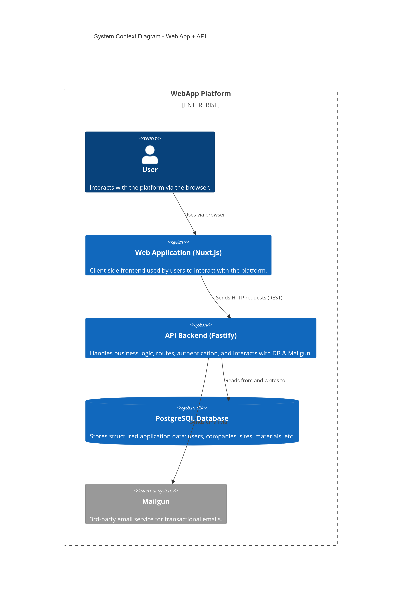
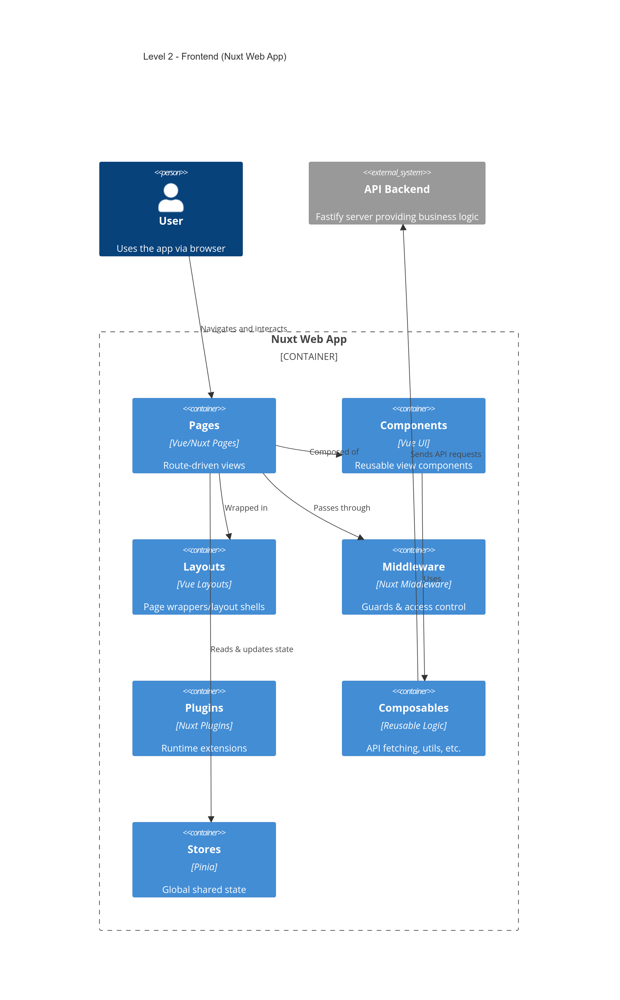
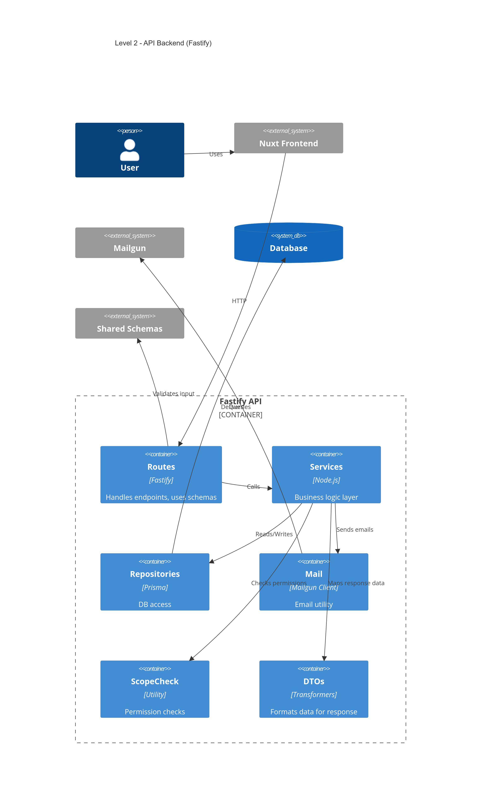
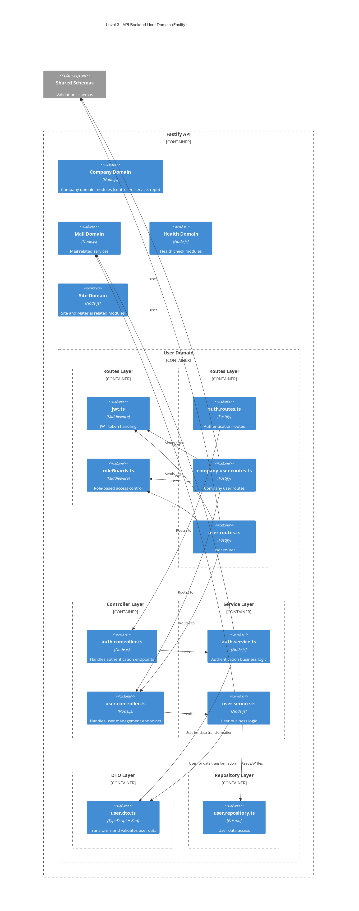
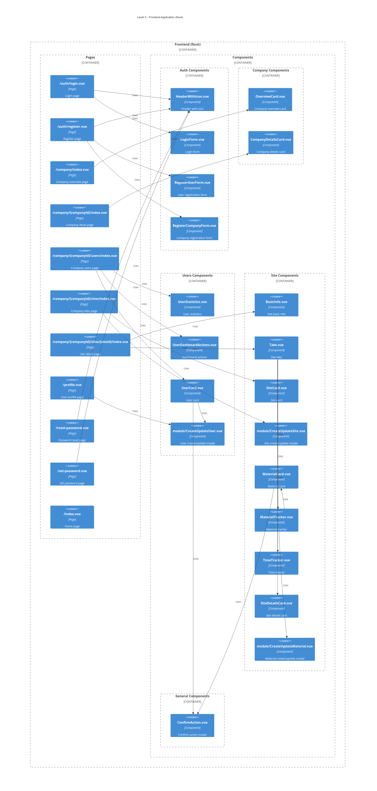

# Building Block View

## Whitebox Overall System

**Motivation**
This system is a modular, full-stack web application supporting multi-tenant company management, role-based access control, site and material tracking, and email-based authentication. The architecture separates concerns clearly into frontend, backend, shared validation, and third-party integrations.

**Contained Building Blocks**
* **Web Frontend (Nuxt)**
* **API Backend (Fastify)** — includes controllers, services, repositories, routes, and DTOs for domain mapping
* **PostgreSQL Database**
* **Shared Zod Schemas and TypeScript Types**
* **Mailgun Integration**

**Important Interfaces**
* REST API between frontend and backend
* Prisma ORM between backend and database
* Mailgun HTTP API integration
* Shared validation schemas (Zod) used across frontend and backend

---

### Web Frontend

**Purpose/Responsibility**
Client-side Nuxt app with pages and components mirroring backend domains and routes. Uses shared types for validation and props.

**Interfaces**
* REST API
* Shared Zod-inferred types

**Location**
`/frontend/`

---

### API Backend

**Purpose/Responsibility**
Fastify-based backend structured by domain modules. Each domain encapsulates controllers, services, repositories, routes, and DTOs (data transfer objects) that handle input/output mapping and business logic. DTOs transform data between raw inputs, validated shared schemas, and internal domain models.

**Interfaces**
* REST API
* Prisma ORM
* Shared Zod schemas for validation
* Internal DTOs for data mapping

**Location**
`/backend/`

---

### PostgreSQL Database

**Purpose/Responsibility**
Persistent storage of domain data such as companies, users, sites, and materials.

**Interfaces**
* Prisma ORM

---

### Shared Zod Schemas and Types

**Purpose/Responsibility**
Reusable, strongly-typed validation schemas shared between backend and frontend. Defines input/output contract schemas for routes and forms.

**Interfaces**
* Consumed by API backend and frontend app for validation and type safety

**Location**
`/shared/`

---

### Mailgun Integration

**Purpose/Responsibility**
Third-party transactional email service used by backend’s mail module. Abstracted into service and sender layers.

**Interfaces**
* Mailgun HTTP API
* Used by authentication and user services

---

## Level 2

### Web Frontend (Nuxt)

* File-based routing with pages for auth, company, user, site, and profile
* Modular components grouped by domain (Auth, Company, Users, Site)
* Uses shared Zod types for form validation and props

---

### API Backend (Fastify)

- **Plugins:** JWT auth, role guards
- **Mail module:** mail.service.ts and mail.sender.ts
- **Health check module**
- **Company module** (controller, service, repository, dto, routes)
- **User module** (auth and user controllers, services, repositories, dtos, routes)
- **Site module** with nested materials submodule (all layers)
- DTO layer maps shared schema types to domain models and response shapes

---

### Shared Zod Schema Module

- Defines and exports Zod schemas and inferred types for validation
- Shared by both backend and frontend for consistency and developer experience

---

Got it! Here's a polished **Level 3** description and summary for your User Domain API and Web Component Structure, aligned with your provided Level 2 context and diagram notes.

---

## Level 3

### User Domain API (Fastify)

* **Layered architecture for User Domain:**

  * **Routes:** `auth.routes.ts`, `user.routes.ts`, `company.user.routes.ts` — entry points defining HTTP endpoints and middleware integration (JWT, role guards).
  * **Controllers:** `auth.controller.ts`, `user.controller.ts` — handle HTTP requests, invoke services, return responses.
  * **Services:** `auth.service.ts`, `user.service.ts` — encapsulate business logic such as authentication, user management, and token handling.
  * **DTOs:** `user.dto.ts` — transform and validate data models using TypeScript and Zod schemas, ensuring consistent API data shapes.
  * **Repositories:** `user.repository.ts` — Prisma-powered data access layer interacting with the database for user persistence.
* **Integration:**

  * **Mail Service:** sends transactional emails (password reset, verification).
  * **Middleware:** JWT and role guards enforce security and authorization on routes.
* **Decoupled Design:** Clear separation of concerns allows independent evolution of authentication and user management features.

---

### Component Structure Web (Nuxt)

* **File-based routing structure** for auth, company, user, site, and profile pages.
* **Modular component groups:**

  * **Auth Components:** `HeaderWithIcon.vue`, `LoginForm.vue`, `RegisterUserForm.vue`, `RegisterCompanyForm.vue`
  * **Company Components:** `OverviewCard.vue`, `CompanyDetailsCard.vue`
  * **User Components:** `UserStatistics.vue`, `UserDashboardActions.vue`, `UserCard.vue`, `modals/CreateUpdateUser.vue`
  * **Site Components:** `BasicInfo.vue`, `Tabs.vue`, `SiteCard.vue`, `modals/CreateUpdateSite.vue`, plus nested material tracking components.
  * **General Components:** `ConfirmAction.vue` modal for confirmation dialogs.
* **Pages use these components** to compose views such as login, registration, company user management, site detail, and profile.
* **Consistent validation and typing** using shared Zod schemas across frontend and backend.
* **Frontend connects to API** for data operations and business logic via HTTP calls.

---
