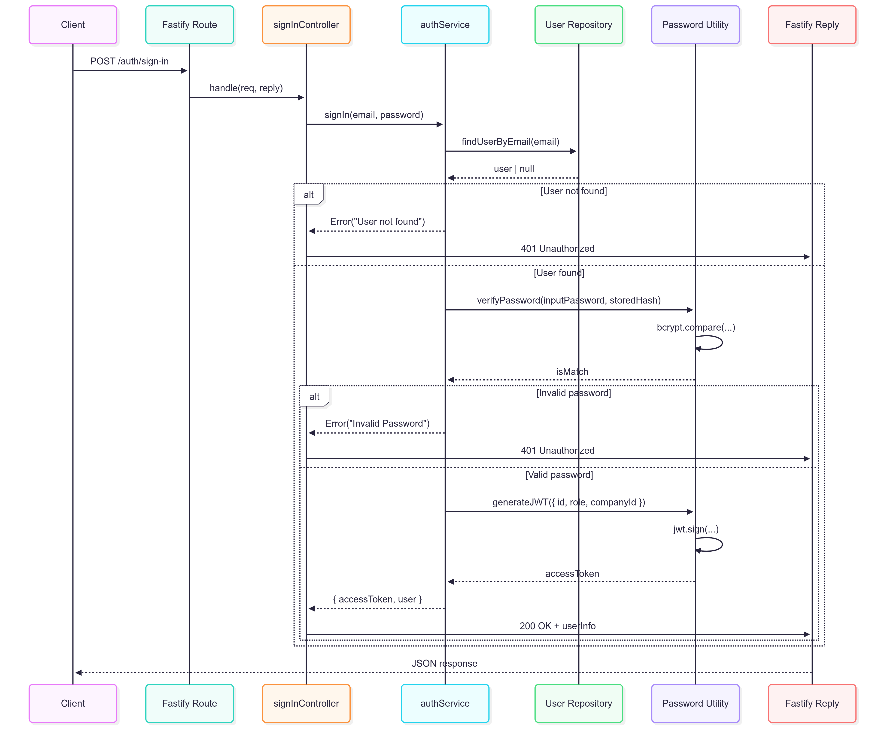
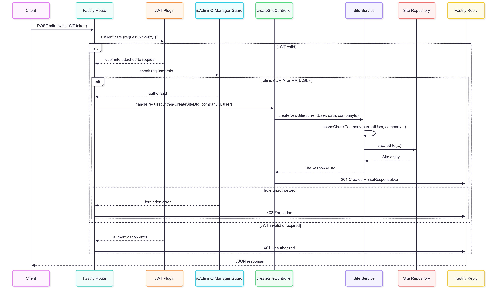
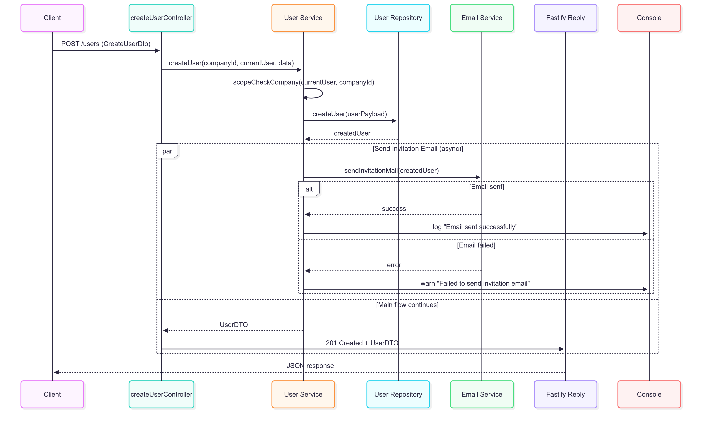

# 6 Runtime View

This section describes key runtime scenarios of the system, illustrating important step-by-step interactions and workflows.

## 6.1 Sign-In Flow

* 

* This scenario covers the process of a user logging into the system, including verifying credentials, generating JWT tokens, and returning authentication information.

* Notable aspects include the validation of user credentials, password hashing verification, JWT token generation with embedded claims, and error handling for invalid login attempts.

## 6.2 Authentication and Authorization Flow

* 

* This scenario illustrates how protected routes are secured by verifying JWT tokens and enforcing role-based access control with guards, ensuring only authorized users can access specific resources.

* Key interactions include JWT verification middleware, role guard checks, and how unauthorized requests are rejected before reaching business logic.

## 6.3 Email Invitation Flow

* 

* This scenario demonstrates how a Construction Manager creates a new user, triggering an invitation email via Mailgun, while role-based access control ensures proper permissions are enforced.

* Important aspects involve company scope validation, user creation with default inactive status, asynchronous email invitation dispatch, and handling email sending success/failure.
