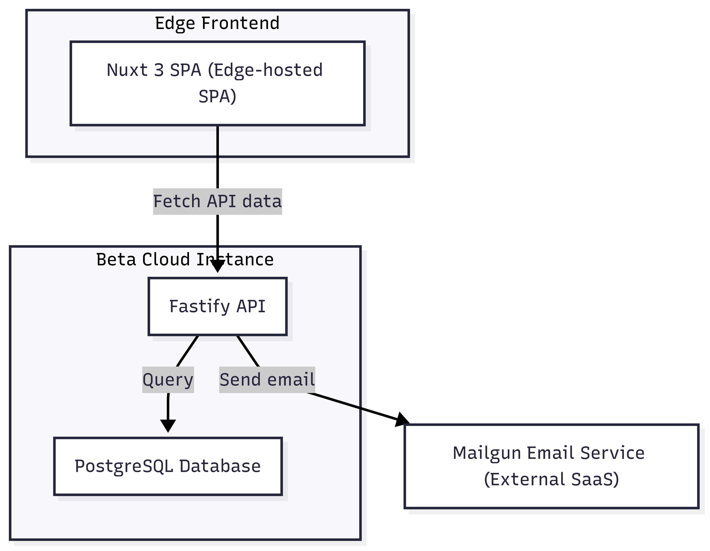
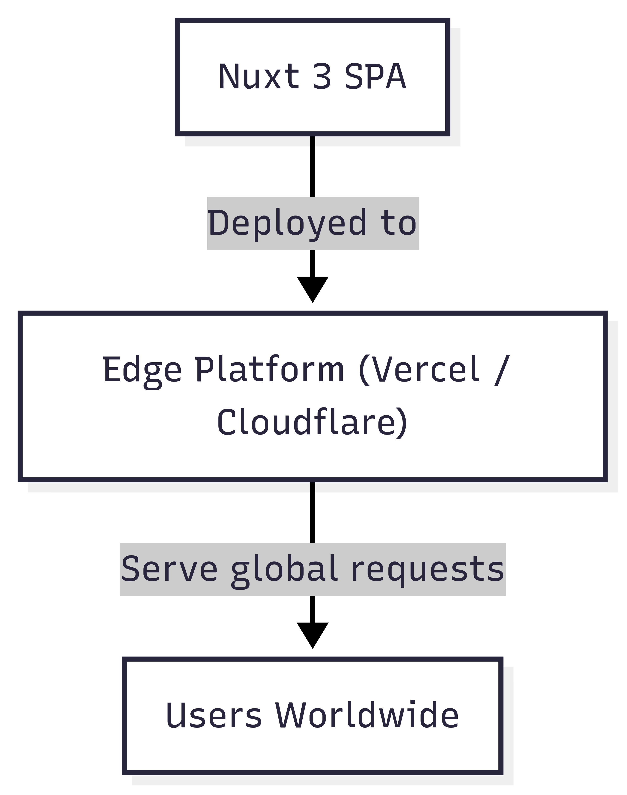
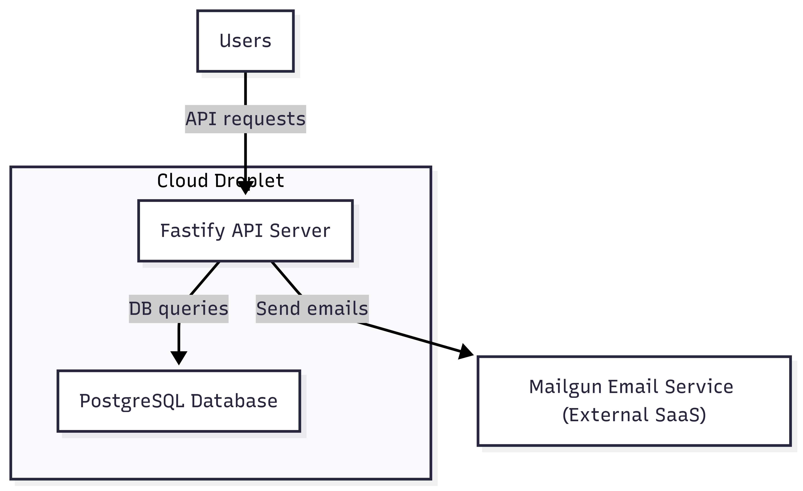
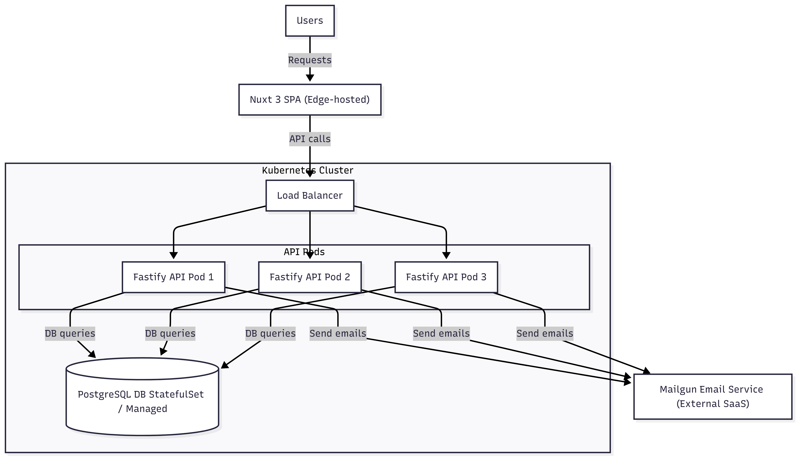

# Deployment View

## Infrastructure Level 1 {#_infrastructure_level_1}

**Overview Diagram**

**Motivation**

The deployment architecture is designed to enable rapid beta testing with minimal operational overhead and to scale efficiently to production with robustness and high availability. Deploying the frontend as an Edge-hosted SPA ensures fast global load times and low latency, while the backend and database are initially co-located for simplicity during beta. For production, containerization and orchestration with Kubernetes provide scalability, resilience, and seamless updates.

**Quality and/or Performance Features**

- Low latency and fast content delivery via Edge CDN for the frontend.
- Simplified beta infrastructure reduces costs and complexity, enabling quick iterations.
- Kubernetes-based production deployment ensures high availability, horizontal scalability, and zero-downtime deployments if needed in later .
- Managed or orchestrated database ensures data durability and backup capabilities.

**Mapping of Building Blocks to Infrastructure**

- The **Frontend (Nuxt 3 SPA)** is deployed on an Edge platform (e.g., Vercel or Cloudflare Workers), serving static assets and SSR content globally.
- The **Backend API (Fastify)** and **PostgreSQL database** run on a single cloud droplet during beta, handling all dynamic requests and data persistence.
- In production, the backend API and database are deployed as containers within a Kubernetes cluster, enabling scalability and fault tolerance.
- The **Mailgun email service** is an external SaaS integrated over HTTPS, requiring no deployment infrastructure.

---

## Infrastructure Level 2

### "Edge Frontend Platform"

The frontend SPA built with Nuxt 3 is deployed on an Edge platform that provides a global CDN with server-side rendering capabilities. This ensures low-latency delivery and high availability without manual scaling or infrastructure management.

---

### "Beta Backend and Database on Cloud Droplet"

For beta, the backend API server and the PostgreSQL database run on a single cloud droplet to minimize complexity and cost. The API handles all business logic and communicates with the database and Mailgun email service.

---

### "Production Kubernetes Cluster"

In production, the backend API and database are containerized and deployed inside a Kubernetes cluster. A load balancer routes traffic to multiple API pods for high availability and scalability. The database runs either as a managed service or a Kubernetes StatefulSet with persistent storage. The frontend remains deployed on the Edge platform.
